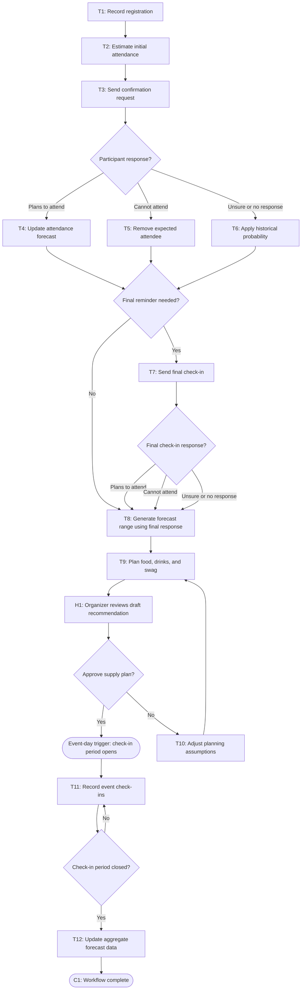

# Workflow of Tasks

## 1. Workflow Overview
### 1.1 Workflow Goal
This workflow supports the system goal defined in `my_first_agent/README.md`.

### 1.2 Workflow Trigger

The workflow starts when a participant registers to attend the hackathon. A separate event-day trigger starts the check-in stage when the event's check-in period opens.

### 1.3 Completion Condition at Runtime

The workflow completes when the event check-in period closes, aggregate check-in results are recorded, and the forecast is compared with actual attendance for future planning.

### 1.4 General Workflow

When a participant registers, HackTrack stores only the registration information necessary for attendance planning, such as registration date, event type, and an optional attendance-confidence response. It does not collect unrelated personal data or infer sensitive characteristics. The system begins with CPVC’s historical attendance rate and adjusts the event forecast as participants voluntarily confirm, decline, or indicate that they are unsure.

HackTrack sends at most two concise reminders: one confirmation request several days before the event and, if necessary, one final check-in shortly before the event. Participants can opt out of reminders. Responses to the final check-in are captured as aggregate planning inputs: a plan to attend increases the expected attendance evidence, a decline decreases it, and an unsure or missing response retains uncertainty and the historical probability. The system does not treat silence as confirmation.

After the response window closes, HackTrack combines the aggregate responses with historical attendance patterns and produces a forecast range and uncertainty level. It then prepares a draft recommendation for food, drinks, and swag, including scenario comparisons, estimated cost, shortage risk, leftover risk, and assumptions. An organizer reviews the draft recommendation before approving a supply plan.

Once the plan is approved, the workflow waits for the separate event-day trigger. When the event check-in period opens, actual check-ins are recorded in aggregate. When check-in closes, the forecast is compared with actual attendance and the aggregate result is retained for future forecasts.

### 1.5 Workflow Diagram

